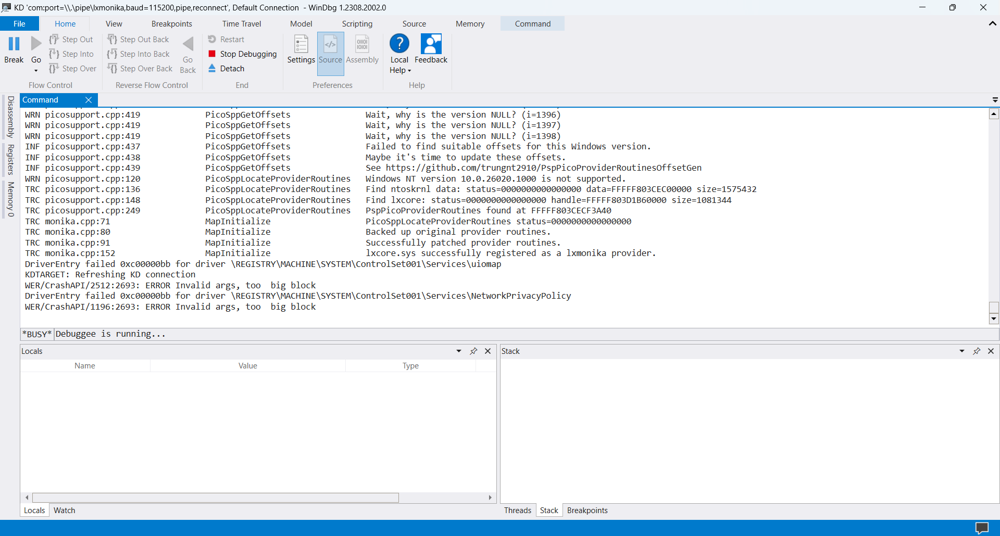

# TcpToPipe

[](https://discord.gg/bcV3gXGtsJ)&nbsp;

Forwards a named pipe server to a remote TCP server.

## Usage

`TcpToPipe --remote remotehost:port --pipe pipename`

## Use case - Remote debugging

This is mainly used to connect to virtual machines where KDNET is faulty to WinDbg.
QEMU supports forwarding serial port output to a TCP server, while WinDbg supports
reading COM debugging data from named pipes instead of COM devices to serve KVM guests.

The tool is currently being used to debug ARM64 builds of
[`lxmonika`](https://github.com/trungnt2910/lxmonika) on QEMU-KVM.

### On a machine running ARM64 Linux:

```bash
qemu-system-aarch64 \
  -M virt -m 12G -cpu host -smp 8,sockets=1,cores=8 \
  -accel kvm \
# a bunch of other options
  -serial tcp::3333,server=on,wait=off,nodelay=off \
  -vnc :0
```

### On the virtual machine:

```cmd
bcdedit /debug on
bcdedit /dbgsettings serial debugport:1 baudrate:115200
```

The port number is usually `1`, **not 0**. You might need to increase this index if you have added
other serial ports in the QEMU command line arguments before the chosen debugging device.

### On the Windows debugger client:

```
TcpToPipe --remote linuxhostname.local:3333 --pipe lxmonika
```

After that, follow
[this guide](https://learn.microsoft.com/en-us/windows-hardware/drivers/debugger/attaching-to-a-virtual-machine--kernel-mode-)
from Microsoft, treating `lxmonika` as `PipeName`. Since the pipe is open on your local computer,
you should ignore the `VMHost` part.



## Community

Need help using this project? Join me on [Discord](https://discord.gg/bcV3gXGtsJ) and find a
solution together.
